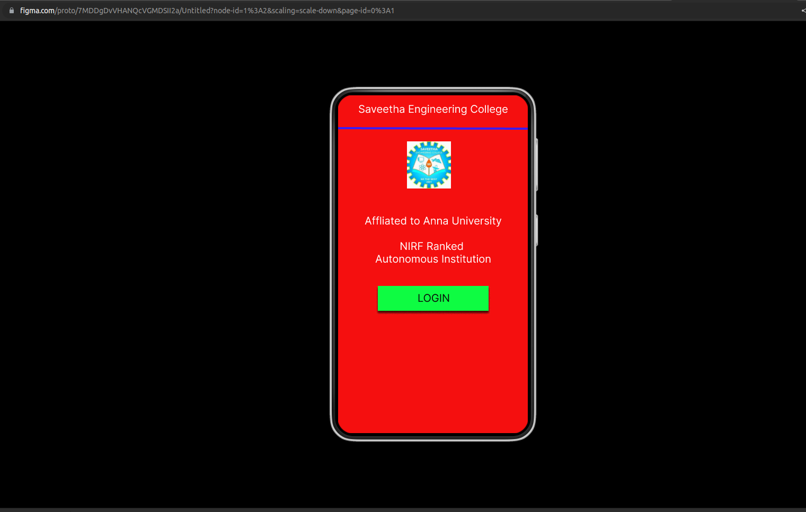
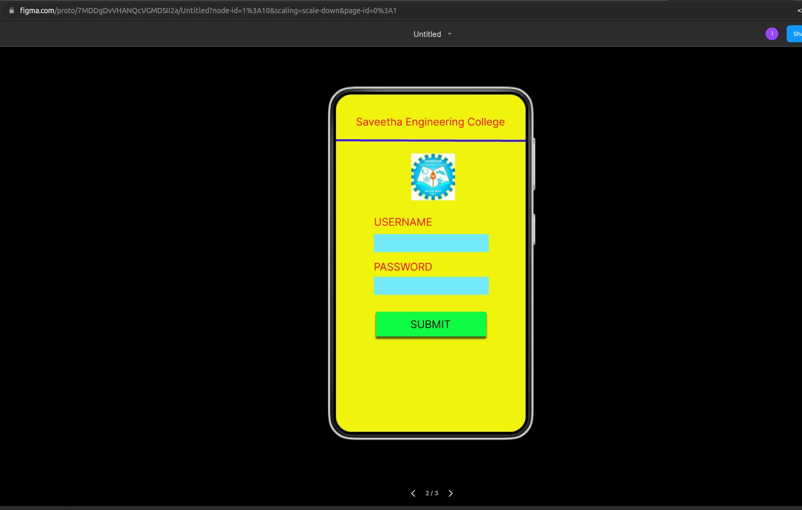
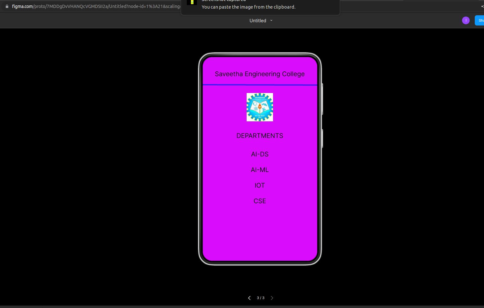

# Event Registration Web Application

## AIM:
To design, develop and deploy a web application for event registration.

## DESIGN STEPS:

### Step 1:
Create a new frame.

### Step 2:
Select any one preset size of your choice.

### Step 3:
Select the shapes you need.

### Step 4:
Import images as needed.

### Step 5:
Create pages based on your need and link them.

### Step 6:

Validate the HTML and CSS code.

### Step 6:

Publish the website in the given URL.

## DESIGN TOOL:
Figma
## CODE
"""
/* Home Page */

box-sizing: border-box;

position: relative;
width: 360px;
height: 640px;
background: #F50F0F;
border: 1px solid #000000;
box-shadow: 0px 4px 4px rgba(0, 0, 0, 0.25);

/* Login Page */
position: relative;
width: 360px;
height: 640px;

background: #F0F40C;

/* Saveetha Engineering College */
position: absolute;
width: 339px;
height: 44px;
left: 10px;
top: 31px;

font-family: 'Inter';
font-style: normal;
font-weight: 400;
font-size: 20px;
line-height: 24px;
display: flex;
align-items: center;
text-align: center;

color: #090808;

/* DEPARTMENTS */

position: absolute;
width: 339px;
height: 44px;
left: 10px;
top: 225px;

font-family: 'Inter';
font-style: normal;
font-weight: 400;
font-size: 20px;
line-height: 24px;
display: flex;
align-items: center;
text-align: center;

color: #090808;

/* AI-ML */
position: absolute;
width: 339px;
height: 44px;
left: 10px;
top: 332px;

font-family: 'Inter';
font-style: normal;
font-weight: 400;
font-size: 20px;
line-height: 24px;
display: flex;
align-items: center;
text-align: center;
color: #090808;

/* IOT */
position: absolute;
width: 339px;
height: 44px;
left: 10px;
top: 381px;

font-family: 'Inter';
font-style: normal;
font-weight: 400;
font-size: 20px;
line-height: 24px;
display: flex;
align-items: center;
text-align: center;

color: #090808;

/* CSE */
position: absolute;
width: 339px;
height: 44px;
left: 10px;
top: 430px;

font-family: 'Inter';
font-style: normal;
font-weight: 400;
font-size: 20px;
line-height: 24px;
display: flex;
align-items: center;
text-align: center;

color: #090808;

/* AI-DS */
position: absolute;
width: 339px;
height: 44px;
left: 10px;
top: 283px;

font-family: 'Inter';
font-style: normal;
font-weight: 400;
font-size: 20px;
line-height: 24px;
display: flex;
align-items: center;
text-align: center;
color: #090808;

/* Line 3 */

position: absolute;
width: 360px;
height: 0px;
left: 0px;
top: 89px;
background: #D9D9D9;
border: 4px solid #3A1CF5;
transform: rotate(0.16deg);

/* logo 3 */

position: absolute;
width: 83px;
height: 89px;
left: 138px;
top: 113px;

background: url(logo.jpg);
"""

## OUTPUT:

## RESULT:
The program to design, develop and deploy a web application for event registration is completed successfully.